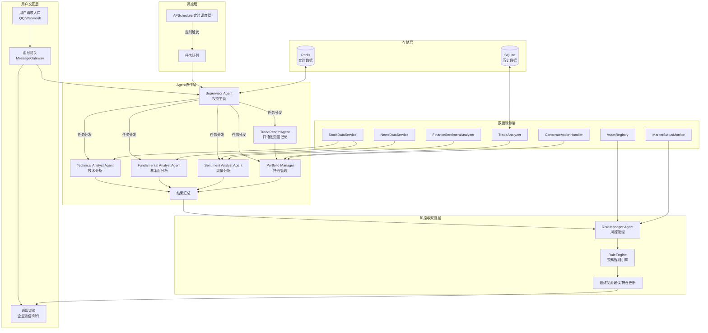
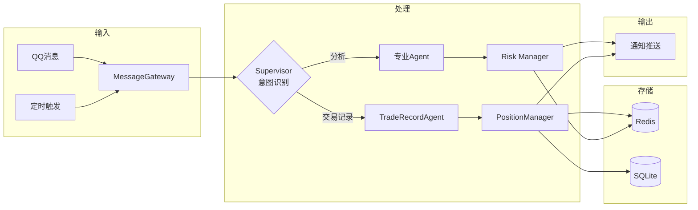

# 个人炒股助手系统Vibe Coding完整实施指南

## 1. 执行摘要

本文档是个人炒股助手系统的完整技术实施指南，专为Vibe Coding（AI辅助编程）开发模式设计。系统基于LangGraph + LangChain构建Multi Agent协作架构，旨在为个人投资者提供专业级的投资决策支持服务。

### 1.1 系统核心目标

系统通过整合多源市场数据、实时舆情分析和技术指标计算，模拟真实投研团队的工作模式，实现专业分工与协同决策。核心功能包括：市场舆情分析、K线技术分析、口语化交易记录、持仓与监控管理、定时推送、交易规则与风控。

### 1.2 架构概览

|维度|规格|
|:---|:---|
|Agent数量|7个（Supervisor + 6个专业Agent）|
|Tool数量|14个核心工具模块|
|核心框架|LangGraph + LangChain|
|数据源|AKShare（免费、全覆盖）|
|技术分析|TA-Lib（C底层高性能）|
|情感分析|二郎神Erlangshen（中文金融优化）|
|定时调度|APScheduler（轻量级异步）|
|消息通信|NapCatQQ + NoneBot2 / 企业微信Webhook|
|持久化|Redis（实时状态）+ SQLite（历史数据）|

## 2. 系统架构总览

### 2.1 整体架构图



### 2.2 七个Agent清单

|Agent|职责|输入|输出|依赖Tool|
|:---|:---|:---|:---|:---|
|Supervisor|系统中枢，意图识别、任务分发、结果汇总|用户查询、股票代码|综合报告、操作建议|NLUParser、所有Agent输出|
|Technical Analyst|K线数据和技术指标计算与解读|股票代码、K线数据|形态识别、买卖信号|StockDataService、TechnicalAnalyzer、AssetRegistry|
|Fundamental Analyst|财务数据和行业信息分析|股票代码、财报数据|估值分析、行业对比|StockDataService、AssetRegistry|
|Sentiment Analyst|市场情绪和舆论风向监测|股票代码、新闻文本|情感分析、舆情预警|NewsDataService、FinanceSentimentAnalyzer|
|Risk Manager|投资建议和交易操作风控审核|投资建议、持仓信息|风险评估、通过/拒绝|RuleEngine、MarketStatusMonitor、PositionManager|
|TradeRecordAgent|解析用户口语化交易记录|口语化描述|结构化交易记录|NLUParser、PositionManager|
|Portfolio Manager|管理关注股票和持仓信息|交易记录、用户指令|持仓详情、交易统计|WatchlistManager、PositionManager、TradeAnalyzer|

### 2.3 十四个核心Tool清单

|Tool|功能描述|依赖库|
|:---|:---|:---|
|StockDataService|获取实时行情、历史K线、股票基本信息|AKShare|
|TechnicalAnalyzer|计算MACD、RSI、KDJ等指标，识别K线形态|TA-Lib|
|NewsDataService|获取个股及市场新闻|AKShare|
|FinanceSentimentAnalyzer|中文金融文本情感分析|transformers、Erlangshen|
|TradeAnalyzer|统计历史交易数据，计算盈亏|SQLAlchemy|
|WeChatWorkNotifier|企业微信Webhook消息推送|requests|
|NLUParser|解析口语化指令，提取结构化信息|LangChain、LLM|
|WatchlistManager|管理用户关注股票列表|Redis、SQLite|
|PositionManager|管理持仓增减、成本计算|Redis、SQLite|
|StorageManager|Redis和SQLite统一数据存取接口|Redis、SQLAlchemy|
|AssetRegistry|股票/ETF资产信息、交易规则存储|SQLite、AKShare|
|RuleEngine|校验交易指令是否符合A股规则|Python硬编码|
|MarketStatusMonitor|监控市场交易状态（开盘/休市/停牌）|AKShare|
|CorporateActionHandler|处理除权除息，自动调整持仓|Python硬编码|

### 2.4 完整技术栈清单

|分类|技术|用途|
|:---|:---|:---|
|核心框架|LangGraph|Multi Agent工作流编排|
|核心框架|LangChain|LLM应用开发、工具调用|
|核心框架|langchain-openai|OpenAI模型接口|
|数据获取|AKShare|A股/港股数据接口|
|技术分析|TA-Lib|高性能技术指标计算|
|情感分析|transformers|Hugging Face模型加载|
|情感分析|torch|PyTorch深度学习|
|定时调度|APScheduler|异步定时任务|
|消息通信|NapCatQQ|QQ协议端|
|消息通信|NoneBot2|Python机器人框架|
|持久化|Redis|实时状态存储|
|持久化|SQLite|历史数据存储|
|持久化|langgraph-checkpoint-redis|LangGraph检查点|
|Web框架|FastAPI|API接口服务|
|Web框架|uvicorn|ASGI服务器|
|辅助|chinese-calendar|中国节假日判断|
|辅助|pydantic|数据验证|
|辅助|pandas|数据处理|
|辅助|SQLAlchemy|ORM框架|

### 2.5 数据流向图



## 3. 项目目录结构

```
stock_assistant/
├── main.py                          # 应用入口，FastAPI实例
├── config.yaml                      # 主配置文件
├── requirements.txt                 # Python依赖
├── .env                             # 环境变量（API密钥等）
├── docker-compose.yml               # Docker编排
├── README.md                        # 项目说明
│
├── config/                          # 配置模块
│   ├── __init__.py
│   ├── settings.py                  # 配置加载与验证
│   └── constants.py                 # 常量定义（股票代码映射等）
│
├── models/                          # 数据模型
│   ├── __init__.py
│   ├── state.py                     # StockAnalysisState状态定义
│   ├── entities.py                  # Position、TradeRecord等实体
│   ├── enums.py                     # BoardType、TradeAction等枚举
│   └── schemas.py                   # API请求/响应Schema
│
├── storage/                         # 存储层
│   ├── __init__.py
│   ├── redis_client.py              # Redis连接管理
│   ├── sqlite_client.py             # SQLite连接管理
│   ├── storage_manager.py           # 统一存储接口
│   └── migrations/                  # 数据库迁移脚本
│       └── init_tables.sql
│
├── tools/                           # 工具模块
│   ├── __init__.py
│   ├── data/                        # 数据服务
│   │   ├── __init__.py
│   │   ├── stock_data_service.py    # AKShare股票数据
│   │   └── news_data_service.py     # 新闻数据获取
│   │
│   ├── analysis/                    # 分析工具
│   │   ├── __init__.py
│   │   ├── technical_analyzer.py    # TA-Lib技术分析
│   │   ├── sentiment_analyzer.py    # 情感分析
│   │   └── trade_analyzer.py        # 交易统计分析
│   │
│   ├── registry/                    # 资产与市场
│   │   ├── __init__.py
│   │   ├── asset_registry.py        # 资产注册表
│   │   ├── market_status_monitor.py # 市场状态监控
│   │   └── corporate_action_handler.py # 除权除息处理
│   │
│   ├── rules/                       # 规则引擎
│   │   ├── __init__.py
│   │   └── rule_engine.py           # 交易规则校验
│   │
│   ├── portfolio/                   # 持仓管理
│   │   ├── __init__.py
│   │   ├── watchlist_manager.py     # 监控列表管理
│   │   └── position_manager.py      # 持仓管理
│   │
│   └── nlp/                         # 自然语言处理
│       ├── __init__.py
│       └── nlu_parser.py            # 口语化指令解析
│
├── agents/                          # Agent模块
│   ├── __init__.py
│   ├── base_agent.py                # Agent基类
│   ├── supervisor_agent.py          # Supervisor投资主管
│   ├── technical_analyst_agent.py   # 技术分析Agent
│   ├── fundamental_analyst_agent.py # 基本面分析Agent
│   ├── sentiment_analyst_agent.py   # 舆情分析Agent
│   ├── risk_manager_agent.py        # 风控Agent
│   ├── trade_record_agent.py        # 交易记录Agent
│   ├── portfolio_manager_agent.py   # 持仓管理Agent
│   └── graph.py                     # LangGraph工作流构建
│
├── gateways/                        # 消息网关
│   ├── __init__.py
│   ├── message_gateway.py           # 统一消息网关
│   ├── qq_bot/                      # QQ机器人
│   │   ├── __init__.py
│   │   ├── bot.py                   # NoneBot2入口
│   │   └── handlers.py              # 消息处理器
│   └── notifiers/                   # 通知推送
│       ├── __init__.py
│       ├── wechat_work_notifier.py  # 企业微信
│       └── email_notifier.py        # 邮件通知
│
├── schedulers/                      # 定时调度
│   ├── __init__.py
│   ├── scheduler.py                 # APScheduler配置
│   └── jobs/                        # 定时任务
│       ├── __init__.py
│       ├── daily_analysis_job.py    # 每日分析任务
│       └── data_sync_job.py         # 数据同步任务
│
├── api/                             # API路由
│   ├── __init__.py
│   ├── routes.py                    # FastAPI路由
│   └── middlewares.py               # 中间件
│
├── utils/                           # 工具函数
│   ├── __init__.py
│   ├── retry.py                     # 重试装饰器
│   ├── logger.py                    # 日志配置
│   └── helpers.py                   # 辅助函数
│
└── tests/                           # 测试
    ├── __init__.py
    ├── conftest.py                  # pytest配置
    ├── test_tools/                  # Tool测试
    ├── test_agents/                 # Agent测试
    └── test_integration/            # 集成测试
```

## 4. 核心模块开发顺序

开发遵循依赖关系，按Phase顺序推进：

### 4.1 Phase 1：基础设施（第1周）

|顺序|模块|文件|说明|
|:---|:---|:---|:---|
|1.1|配置管理|config/settings.py|YAML配置加载、环境变量读取|
|1.2|常量定义|config/constants.py|股票代码映射、关键词列表|
|1.3|枚举类型|models/enums.py|BoardType、TradeAction等|
|1.4|数据实体|models/entities.py|Position、TradeRecord|
|1.5|状态定义|models/state.py|StockAnalysisState|
|1.6|Redis连接|storage/redis_client.py|连接池、基础操作|
|1.7|SQLite连接|storage/sqlite_client.py|SQLAlchemy引擎|
|1.8|存储管理|storage/storage_manager.py|统一接口封装|

### 4.2 Phase 2：数据服务层（第2周）

|顺序|模块|文件|说明|
|:---|:---|:---|:---|
|2.1|股票数据|tools/data/stock_data_service.py|AKShare封装|
|2.2|新闻数据|tools/data/news_data_service.py|新闻获取|
|2.3|技术分析|tools/analysis/technical_analyzer.py|TA-Lib封装|
|2.4|情感分析|tools/analysis/sentiment_analyzer.py|Erlangshen模型|
|2.5|交易统计|tools/analysis/trade_analyzer.py|历史交易分析|

### 4.3 Phase 3：资产与规则（第3周）

|顺序|模块|文件|说明|
|:---|:---|:---|:---|
|3.1|资产注册表|tools/registry/asset_registry.py|股票/ETF信息|
|3.2|市场状态|tools/registry/market_status_monitor.py|交易状态监控|
|3.3|企业行动|tools/registry/corporate_action_handler.py|除权除息处理|
|3.4|规则引擎|tools/rules/rule_engine.py|交易规则校验|

### 4.4 Phase 4：持仓管理（第3-4周）

|顺序|模块|文件|说明|
|:---|:---|:---|:---|
|4.1|监控列表|tools/portfolio/watchlist_manager.py|关注股票管理|
|4.2|持仓管理|tools/portfolio/position_manager.py|持仓增减、成本|

### 4.5 Phase 5：Agent层（第4-5周）

|顺序|模块|文件|说明|
|:---|:---|:---|:---|
|5.1|Agent基类|agents/base_agent.py|通用接口定义|
|5.2|Supervisor|agents/supervisor_agent.py|核心路由Agent|
|5.3|技术分析Agent|agents/technical_analyst_agent.py|K线分析|
|5.4|基本面Agent|agents/fundamental_analyst_agent.py|财务分析|
|5.5|舆情Agent|agents/sentiment_analyst_agent.py|情感分析|
|5.6|交易记录Agent|agents/trade_record_agent.py|口语化解析|
|5.7|持仓Agent|agents/portfolio_manager_agent.py|持仓管理|
|5.8|风控Agent|agents/risk_manager_agent.py|风险审核|
|5.9|工作流构建|agents/graph.py|LangGraph编排|

### 4.6 Phase 6：消息网关（第5-6周）

|顺序|模块|文件|说明|
|:---|:---|:---|:---|
|6.1|NLU解析|tools/nlp/nlu_parser.py|口语化指令解析|
|6.2|消息网关|gateways/message_gateway.py|统一消息接口|
|6.3|QQ机器人|gateways/qq_bot/|NoneBot2集成|
|6.4|企业微信|gateways/notifiers/wechat_work_notifier.py|消息推送|

### 4.7 Phase 7：定时调度（第6周）

|顺序|模块|文件|说明|
|:---|:---|:---|:---|
|7.1|调度器|schedulers/scheduler.py|APScheduler配置|
|7.2|每日分析|schedulers/jobs/daily_analysis_job.py|定时分析任务|
|7.3|数据同步|schedulers/jobs/data_sync_job.py|资产数据同步|

### 4.8 Phase 8：API与集成（第7周）

|顺序|模块|文件|说明|
|:---|:---|:---|:---|
|8.1|API路由|api/routes.py|FastAPI端点|
|8.2|应用入口|main.py|应用启动|
|8.3|单元测试|tests/|测试覆盖|

## 5. 关键代码片段索引

### 5.1 StockAnalysisState状态定义

```python
# models/state.py
from typing import TypedDict, List, Optional, Annotated, Dict
from pydantic import BaseModel
from langgraph.graph import add_messages
from datetime import datetime
from enum import Enum

class BoardType(str, Enum):
    MAIN_BOARD = "主板"
    GEM_BOARD = "创业板"
    STAR_BOARD = "科创板"
    BEIJING_BOARD = "北交所"
    ETF = "ETF"

class TradeAction(str, Enum):
    BUY = "买入"
    SELL = "卖出"

class TradingPhase(str, Enum):
    CALL_AUCTION = "集合竞价"
    CONTINUOUS_TRADING = "连续竞价"
    BREAK = "休市"
    CLOSED = "闭市"
    HALTED = "停牌"

class TradeRecord(BaseModel):
    stock_code: str
    stock_name: str
    action: TradeAction
    quantity: int
    price: float
    timestamp: datetime
    confidence: float = 1.0

class Position(BaseModel):
    stock_code: str
    stock_name: str
    quantity: int
    available_quantity: int  # T+1可用数量
    avg_cost: float
    current_price: float
    market_value: float
    profit_loss: float
    profit_loss_ratio: float
    last_update: datetime

class StockAnalysisState(TypedDict):
    """股票分析系统核心状态结构"""
    # 用户输入
    user_query: str
    stock_codes: List[str]
    user_id: str
    session_id: str
    
    # Agent消息流
    messages: Annotated[list, add_messages]
    
    # 各Agent分析结果
    technical_analysis: Optional[dict]
    fundamental_analysis: Optional[dict]
    sentiment_analysis: Optional[dict]
    
    # 汇总结果
    supervisor_summary: Optional[str]
    risk_check_result: Optional[dict]
    final_recommendation: Optional[str]
    
    # 路由控制
    next: str
    iteration_count: int
    error_info: Optional[str]

    # 持仓与监控
    watched_stocks: List[str]
    positions: Dict[str, Position]
    trade_record: Optional[TradeRecord]
    trade_intent_confirmed: bool

    # 资产与市场信息
    security_info: Dict[str, dict]
    market_status: Dict[str, TradingPhase]
    corporate_actions: Dict[str, List[dict]]
```

### 5.2 Supervisor Agent代码框架

```python
# agents/supervisor_agent.py
from langchain_openai import ChatOpenAI
from langchain_core.prompts import ChatPromptTemplate
from models.state import StockAnalysisState
from typing import Literal

SUPERVISOR_SYSTEM_PROMPT = """你是一位资深的投资主管，负责协调团队完成股票分析任务。

你的团队成员包括：
- technical_analyst: 技术分析专家，负责K线和技术指标分析
- fundamental_analyst: 基本面分析师，负责财务和估值分析
- sentiment_analyst: 舆情分析师，负责市场情绪分析
- trade_record_agent: 交易记录员，负责解析用户的口语化交易记录
- portfolio_manager: 持仓管理员，负责管理关注列表和持仓信息
- risk_manager: 风控官，负责最终的风险审核

根据用户的请求，决定下一步应该由哪个团队成员处理。
如果所有必要的分析都已完成，选择FINISH结束流程。

用户请求：{user_query}
当前已完成的分析：{completed_analyses}
"""

def create_supervisor_agent(llm: ChatOpenAI):
    """创建Supervisor Agent"""
    
    members = [
        "technical_analyst",
        "fundamental_analyst", 
        "sentiment_analyst",
        "trade_record_agent",
        "portfolio_manager",
        "risk_manager",
        "FINISH"
    ]
    
    prompt = ChatPromptTemplate.from_messages([
        ("system", SUPERVISOR_SYSTEM_PROMPT),
        ("human", "请决定下一步由谁处理，直接回复成员名称。")
    ])
    
    def supervisor_node(state: StockAnalysisState) -> dict:
        """Supervisor路由决策"""
        # 收集已完成的分析
        completed = []
        if state.get("technical_analysis"):
            completed.append("technical_analyst")
        if state.get("fundamental_analysis"):
            completed.append("fundamental_analyst")
        if state.get("sentiment_analysis"):
            completed.append("sentiment_analyst")
        
        # 意图识别
        query = state["user_query"].lower()
        
        # 口语化交易记录识别
        trade_keywords = ["买了", "卖了", "买入", "卖出", "清仓", "加仓", "建仓"]
        if any(kw in query for kw in trade_keywords):
            return {"next": "trade_record_agent"}
        
        # 持仓查询识别
        position_keywords = ["持仓", "仓位", "关注", "自选"]
        if any(kw in query for kw in position_keywords):
            return {"next": "portfolio_manager"}
        
        # 分析请求路由
        chain = prompt | llm
        response = chain.invoke({
            "user_query": state["user_query"],
            "completed_analyses": ", ".join(completed) if completed else "无"
        })
        
        next_agent = response.content.strip()
        if next_agent not in members:
            next_agent = "technical_analyst"  # 默认技术分析
            
        return {"next": next_agent}
    
    return supervisor_node

def should_continue(state: StockAnalysisState) -> Literal["continue", "end"]:
    """判断是否继续执行"""
    if state.get("next") == "FINISH":
        return "end"
    if state.get("iteration_count", 0) > 10:
        return "end"
    return "continue"
```

### 5.3 LangGraph工作流构建

```python
# agents/graph.py
from langgraph.graph import StateGraph, END
from langgraph.checkpoint.redis import RedisSaver
from models.state import StockAnalysisState
from agents.supervisor_agent import create_supervisor_agent, should_continue
from agents.technical_analyst_agent import technical_analyst_node
from agents.fundamental_analyst_agent import fundamental_analyst_node
from agents.sentiment_analyst_agent import sentiment_analyst_node
from agents.trade_record_agent import trade_record_node
from agents.portfolio_manager_agent import portfolio_manager_node
from agents.risk_manager_agent import risk_manager_node
from langchain_openai import ChatOpenAI
import redis

def create_stock_analysis_graph(redis_url: str = "redis://localhost:6379"):
    """构建股票分析Multi Agent工作流"""
    
    # 初始化LLM
    llm = ChatOpenAI(model="gpt-4o-mini", temperature=0)
    
    # 创建状态图
    workflow = StateGraph(StockAnalysisState)
    
    # 添加节点
    workflow.add_node("supervisor", create_supervisor_agent(llm))
    workflow.add_node("technical_analyst", technical_analyst_node)
    workflow.add_node("fundamental_analyst", fundamental_analyst_node)
    workflow.add_node("sentiment_analyst", sentiment_analyst_node)
    workflow.add_node("trade_record_agent", trade_record_node)
    workflow.add_node("portfolio_manager", portfolio_manager_node)
    workflow.add_node("risk_manager", risk_manager_node)
    
    # 设置入口
    workflow.set_entry_point("supervisor")
    
    # 添加条件边
    workflow.add_conditional_edges(
        "supervisor",
        should_continue,
        {
            "continue": "route_to_agent",
            "end": END
        }
    )
    
    # 路由到具体Agent
    def route_to_agent(state: StockAnalysisState) -> str:
        return state["next"]
    
    workflow.add_conditional_edges(
        "supervisor",
        route_to_agent,
        {
            "technical_analyst": "technical_analyst",
            "fundamental_analyst": "fundamental_analyst",
            "sentiment_analyst": "sentiment_analyst",
            "trade_record_agent": "trade_record_agent",
            "portfolio_manager": "portfolio_manager",
            "risk_manager": "risk_manager",
            "FINISH": END
        }
    )
    
    # 所有Agent完成后返回Supervisor
    for agent in ["technical_analyst", "fundamental_analyst", 
                  "sentiment_analyst", "trade_record_agent",
                  "portfolio_manager", "risk_manager"]:
        workflow.add_edge(agent, "supervisor")
    
    # 配置Redis检查点
    redis_conn = redis.from_url(redis_url)
    checkpointer = RedisSaver(redis_conn)
    
    # 编译图
    app = workflow.compile(checkpointer=checkpointer)
    
    return app

# 使用示例
async def analyze_stock(user_query: str, user_id: str, stock_codes: list):
    """执行股票分析"""
    app = create_stock_analysis_graph()
    
    initial_state = {
        "user_query": user_query,
        "stock_codes": stock_codes,
        "user_id": user_id,
        "session_id": f"{user_id}_{datetime.now().strftime('%Y%m%d%H%M%S')}",
        "messages": [],
        "next": "",
        "iteration_count": 0,
        "watched_stocks": [],
        "positions": {},
        "trade_intent_confirmed": False,
        "security_info": {},
        "market_status": {}
    }
    
    config = {"configurable": {"thread_id": user_id}}
    
    result = await app.ainvoke(initial_state, config)
    return result
```

### 5.4 StockDataService代码框架

```python
# tools/data/stock_data_service.py
import akshare as ak
import pandas as pd
from datetime import datetime, timedelta
from typing import Optional, Dict, List
from functools import lru_cache
from utils.retry import retry_with_backoff
from utils.logger import get_logger

logger = get_logger(__name__)

class StockDataService:
    """股票数据服务 - 基于AKShare"""
    
    def __init__(self):
        self._cache = {}
        self._cache_ttl = 60  # 缓存60秒
    
    @retry_with_backoff(max_retries=3, base_delay=1.0)
    def get_realtime_quote(self, stock_code: str) -> Dict:
        """获取实时行情"""
        try:
            # 东方财富实时行情
            df = ak.stock_zh_a_spot_em()
            row = df[df['代码'] == stock_code].iloc[0]
            
            return {
                "stock_code": stock_code,
                "name": row['名称'],
                "current_price": float(row['最新价']),
                "change_percent": float(row['涨跌幅']),
                "change_amount": float(row['涨跌额']),
                "volume": int(row['成交量']),
                "amount": float(row['成交额']),
                "high": float(row['最高']),
                "low": float(row['最低']),
                "open": float(row['今开']),
                "prev_close": float(row['昨收']),
                "timestamp": datetime.now().isoformat()
            }
        except Exception as e:
            logger.error(f"获取实时行情失败: {stock_code}, {e}")
            raise
    
    @retry_with_backoff(max_retries=3, base_delay=1.0)
    def get_history_kline(
        self, 
        stock_code: str, 
        period: str = "daily",
        start_date: Optional[str] = None,
        end_date: Optional[str] = None,
        adjust: str = "qfq"  # 前复权
    ) -> pd.DataFrame:
        """获取历史K线数据"""
        try:
            if not end_date:
                end_date = datetime.now().strftime("%Y%m%d")
            if not start_date:
                start_date = (datetime.now() - timedelta(days=365)).strftime("%Y%m%d")
            
            df = ak.stock_zh_a_hist(
                symbol=stock_code,
                period=period,
                start_date=start_date,
                end_date=end_date,
                adjust=adjust
            )
            
            # 标准化列名
            df.columns = ['date', 'open', 'close', 'high', 'low', 
                         'volume', 'amount', 'amplitude', 'change_percent',
                         'change_amount', 'turnover']
            df['date'] = pd.to_datetime(df['date'])
            df.set_index('date', inplace=True)
            
            return df
        except Exception as e:
            logger.error(f"获取K线数据失败: {stock_code}, {e}")
            raise
    
    def get_stock_info(self, stock_code: str) -> Dict:
        """获取股票基本信息"""
        try:
            df = ak.stock_individual_info_em(symbol=stock_code)
            info = dict(zip(df['item'], df['value']))
            
            return {
                "stock_code": stock_code,
                "name": info.get('股票简称', ''),
                "industry": info.get('行业', ''),
                "market_cap": info.get('总市值', ''),
                "pe_ratio": info.get('市盈率(动态)', ''),
                "pb_ratio": info.get('市净率', ''),
                "list_date": info.get('上市时间', '')
            }
        except Exception as e:
            logger.error(f"获取股票信息失败: {stock_code}, {e}")
            return {"stock_code": stock_code, "error": str(e)}
    
    def get_financial_data(self, stock_code: str) -> Dict:
        """获取财务数据"""
        try:
            # 财务指标
            df = ak.stock_financial_abstract_ths(symbol=stock_code)
            if df.empty:
                return {"stock_code": stock_code, "error": "无财务数据"}
            
            latest = df.iloc[0]
            return {
                "stock_code": stock_code,
                "report_date": str(latest.get('报告期', '')),
                "eps": latest.get('基本每股收益', 0),
                "roe": latest.get('净资产收益率', 0),
                "gross_margin": latest.get('毛利率', 0),
                "net_margin": latest.get('净利率', 0),
                "revenue_growth": latest.get('营业总收入同比增长率', 0),
                "profit_growth": latest.get('净利润同比增长率', 0)
            }
        except Exception as e:
            logger.error(f"获取财务数据失败: {stock_code}, {e}")
            return {"stock_code": stock_code, "error": str(e)}
```

### 5.5 TechnicalAnalyzer代码框架

```python
# tools/analysis/technical_analyzer.py
import talib
import numpy as np
import pandas as pd
from typing import Dict, List, Tuple
from utils.logger import get_logger

logger = get_logger(__name__)

class TechnicalAnalyzer:
    """技术分析器 - 基于TA-Lib"""
    
    def calculate_macd(
        self, 
        close: np.ndarray,
        fastperiod: int = 12,
        slowperiod: int = 26,
        signalperiod: int = 9
    ) -> Dict:
        """计算MACD指标"""
        macd, signal, hist = talib.MACD(
            close, 
            fastperiod=fastperiod,
            slowperiod=slowperiod,
            signalperiod=signalperiod
        )
        
        # 判断信号
        current_hist = hist[-1]
        prev_hist = hist[-2]
        
        if current_hist > 0 and prev_hist <= 0:
            signal_type = "金叉买入"
        elif current_hist < 0 and prev_hist >= 0:
            signal_type = "死叉卖出"
        elif current_hist > prev_hist:
            signal_type = "多头增强"
        else:
            signal_type = "空头增强"
        
        return {
            "macd": float(macd[-1]) if not np.isnan(macd[-1]) else 0,
            "signal": float(signal[-1]) if not np.isnan(signal[-1]) else 0,
            "histogram": float(hist[-1]) if not np.isnan(hist[-1]) else 0,
            "signal_type": signal_type
        }
    
    def calculate_rsi(self, close: np.ndarray, period: int = 14) -> Dict:
        """计算RSI指标"""
        rsi = talib.RSI(close, timeperiod=period)
        current_rsi = float(rsi[-1])
        
        if current_rsi > 80:
            signal_type = "严重超买"
        elif current_rsi > 70:
            signal_type = "超买"
        elif current_rsi < 20:
            signal_type = "严重超卖"
        elif current_rsi < 30:
            signal_type = "超卖"
        else:
            signal_type = "中性"
        
        return {
            "rsi": current_rsi,
            "signal_type": signal_type
        }
    
    def calculate_kdj(
        self, 
        high: np.ndarray, 
        low: np.ndarray, 
        close: np.ndarray,
        fastk_period: int = 9,
        slowk_period: int = 3,
        slowd_period: int = 3
    ) -> Dict:
        """计算KDJ指标"""
        slowk, slowd = talib.STOCH(
            high, low, close,
            fastk_period=fastk_period,
            slowk_period=slowk_period,
            slowd_period=slowd_period
        )
        
        k = float(slowk[-1])
        d = float(slowd[-1])
        j = 3 * k - 2 * d
        
        if k > d and slowk[-2] <= slowd[-2]:
            signal_type = "金叉买入"
        elif k < d and slowk[-2] >= slowd[-2]:
            signal_type = "死叉卖出"
        elif j > 100:
            signal_type = "超买"
        elif j < 0:
            signal_type = "超卖"
        else:
            signal_type = "中性"
        
        return {
            "k": k,
            "d": d,
            "j": j,
            "signal_type": signal_type
        }
    
    def calculate_bollinger_bands(
        self, 
        close: np.ndarray,
        period: int = 20,
        nbdevup: float = 2,
        nbdevdn: float = 2
    ) -> Dict:
        """计算布林带"""
        upper, middle, lower = talib.BBANDS(
            close,
            timeperiod=period,
            nbdevup=nbdevup,
            nbdevdn=nbdevdn
        )
        
        current_price = close[-1]
        bandwidth = (upper[-1] - lower[-1]) / middle[-1] * 100
        
        if current_price > upper[-1]:
            position = "突破上轨"
        elif current_price < lower[-1]:
            position = "突破下轨"
        elif current_price > middle[-1]:
            position = "中轨上方"
        else:
            position = "中轨下方"
        
        return {
            "upper": float(upper[-1]),
            "middle": float(middle[-1]),
            "lower": float(lower[-1]),
            "bandwidth": bandwidth,
            "position": position
        }
    
    def identify_candlestick_patterns(
        self, 
        open_: np.ndarray, 
        high: np.ndarray, 
        low: np.ndarray, 
        close: np.ndarray
    ) -> List[Dict]:
        """识别K线形态"""
        patterns = []
        
        # 形态识别函数映射
        pattern_functions = {
            "锤子线": talib.CDLHAMMER,
            "吊颈线": talib.CDLHANGINGMAN,
            "吞没形态": talib.CDLENGULFING,
            "早晨之星": talib.CDLMORNINGSTAR,
            "黄昏之星": talib.CDLEVENINGSTAR,
            "十字星": talib.CDLDOJI,
            "三只乌鸦": talib.CDL3BLACKCROWS,
            "三白兵": talib.CDL3WHITESOLDIERS
        }
        
        for name, func in pattern_functions.items():
            try:
                result = func(open_, high, low, close)
                if result[-1] != 0:
                    patterns.append({
                        "pattern": name,
                        "signal": "看涨" if result[-1] > 0 else "看跌",
                        "strength": abs(int(result[-1]))
                    })
            except Exception as e:
                logger.warning(f"形态识别失败 {name}: {e}")
        
        return patterns
    
    def full_analysis(self, df: pd.DataFrame) -> Dict:
        """完整技术分析"""
        close = df['close'].values.astype(float)
        high = df['high'].values.astype(float)
        low = df['low'].values.astype(float)
        open_ = df['open'].values.astype(float)
        
        return {
            "macd": self.calculate_macd(close),
            "rsi": self.calculate_rsi(close),
            "kdj": self.calculate_kdj(high, low, close),
            "bollinger": self.calculate_bollinger_bands(close),
            "patterns": self.identify_candlestick_patterns(open_, high, low, close),
            "analysis_time": pd.Timestamp.now().isoformat()
        }
```

### 5.6 NLUParser代码框架

```python
# tools/nlp/nlu_parser.py
from langchain_openai import ChatOpenAI
from langchain_core.prompts import ChatPromptTemplate
from pydantic import BaseModel, Field
from typing import Optional
from datetime import datetime
from models.entities import TradeRecord, TradeAction
from utils.logger import get_logger

logger = get_logger(__name__)

# 股票简称映射表
STOCK_ALIASES = {
    "茅台": "600519", "贵州茅台": "600519",
    "平安": "601318", "中国平安": "601318",
    "招行": "600036", "招商银行": "600036",
    "腾讯": "00700", "阿里": "09988",
    "宁德": "300750", "宁德时代": "300750",
    "比亚迪": "002594",
    "中芯": "688981", "中芯国际": "688981"
}

# 口语化动作关键词
BUY_KEYWORDS = ["买了", "买入", "加仓", "建仓", "抄底", "入手", "购入"]
SELL_KEYWORDS = ["卖了", "卖出", "清仓", "减仓", "割肉", "止盈", "止损", "出了"]

class ParsedTradeRecord(BaseModel):
    """解析后的交易记录结构"""
    stock_code: str = Field(description="股票代码，6位数字")
    stock_name: str = Field(description="股票名称")
    action: str = Field(description="交易动作：买入或卖出")
    quantity: Optional[int] = Field(default=None, description="交易数量，单位：股")
    price: Optional[float] = Field(default=None, description="交易价格")
    amount: Optional[float] = Field(default=None, description="交易金额")
    confidence: float = Field(default=1.0, description="解析置信度0-1")

class NLUParser:
    """自然语言解析器 - 口语化交易指令"""
    
    def __init__(self, llm: Optional[ChatOpenAI] = None):
        self.llm = llm or ChatOpenAI(model="gpt-4o-mini", temperature=0)
        self.stock_aliases = STOCK_ALIASES
        
        self.prompt = ChatPromptTemplate.from_messages([
            ("system", """你是一个专业的交易记录解析助手。用户会用口语化的方式描述他们的交易操作，你需要从中提取结构化信息。

股票代码映射参考：
{stock_aliases}

数量单位说明：
- "1手" = 100股
- "几百股" 可估算为 300-500股
- 如果只提到金额没提到数量，quantity留空

解析规则：
1. 识别股票名称并映射到代码
2. 判断买入还是卖出
3. 提取数量和价格
4. 根据信息完整度给出置信度"""),
            ("human", "{user_input}")
        ])
        
        # 使用结构化输出
        self.chain = self.prompt | self.llm.with_structured_output(ParsedTradeRecord)
    
    def parse(self, user_input: str) -> TradeRecord:
        """解析用户口语化输入"""
        try:
            # 预处理：快速判断动作类型
            action_hint = self._detect_action(user_input)
            
            # LLM结构化解析
            result = self.chain.invoke({
                "user_input": user_input,
                "stock_aliases": str(self.stock_aliases)
            })
            
            # 补全信息
            if result.quantity is None and result.amount and result.price:
                result.quantity = int(result.amount / result.price)
            
            # 转换为标准TradeRecord
            return TradeRecord(
                stock_code=result.stock_code,
                stock_name=result.stock_name,
                action=TradeAction.BUY if result.action == "买入" else TradeAction.SELL,
                quantity=result.quantity or 0,
                price=result.price or 0.0,
                timestamp=datetime.now(),
                confidence=result.confidence
            )
            
        except Exception as e:
            logger.error(f"解析失败: {user_input}, {e}")
            raise ValueError(f"无法解析交易记录: {e}")
    
    def _detect_action(self, text: str) -> Optional[str]:
        """快速检测交易动作"""
        for kw in BUY_KEYWORDS:
            if kw in text:
                return "买入"
        for kw in SELL_KEYWORDS:
            if kw in text:
                return "卖出"
        return None
    
    def needs_confirmation(self, record: TradeRecord) -> bool:
        """判断是否需要用户确认"""
        if record.confidence < 0.8:
            return True
        if record.quantity == 0 or record.price == 0:
            return True
        return False
```

### 5.7 PositionManager代码框架

```python
# tools/portfolio/position_manager.py
import json
from datetime import datetime
from typing import Dict, List, Optional
from models.entities import Position, TradeRecord, TradeAction
from storage.storage_manager import StorageManager
from utils.logger import get_logger

logger = get_logger(__name__)

class PositionManager:
    """持仓管理器"""
    
    def __init__(self, storage: StorageManager, user_id: str):
        self.storage = storage
        self.user_id = user_id
        self.redis_key = f"positions:{user_id}"
    
    async def get_positions(self) -> Dict[str, Position]:
        """获取所有持仓"""
        data = await self.storage.redis_hgetall(self.redis_key)
        positions = {}
        for code, value in data.items():
            positions[code] = Position(**json.loads(value))
        return positions
    
    async def get_position(self, stock_code: str) -> Optional[Position]:
        """获取单只股票持仓"""
        data = await self.storage.redis_hget(self.redis_key, stock_code)
        if data:
            return Position(**json.loads(data))
        return None
    
    async def add_position(self, record: TradeRecord) -> Position:
        """增加持仓（买入）"""
        existing = await self.get_position(record.stock_code)
        
        if existing:
            # 计算新的平均成本
            total_cost = existing.avg_cost * existing.quantity + record.price * record.quantity
            new_quantity = existing.quantity + record.quantity
            new_avg_cost = total_cost / new_quantity
            
            position = Position(
                stock_code=record.stock_code,
                stock_name=record.stock_name,
                quantity=new_quantity,
                available_quantity=existing.available_quantity,  # T+1，新买入不可用
                avg_cost=new_avg_cost,
                current_price=record.price,
                market_value=new_quantity * record.price,
                profit_loss=(record.price - new_avg_cost) * new_quantity,
                profit_loss_ratio=(record.price - new_avg_cost) / new_avg_cost * 100,
                last_update=datetime.now()
            )
        else:
            position = Position(
                stock_code=record.stock_code,
                stock_name=record.stock_name,
                quantity=record.quantity,
                available_quantity=0,  # T+1，新买入不可用
                avg_cost=record.price,
                current_price=record.price,
                market_value=record.quantity * record.price,
                profit_loss=0,
                profit_loss_ratio=0,
                last_update=datetime.now()
            )
        
        await self._save_position(position)
        await self._record_trade(record)
        
        logger.info(f"持仓更新[买入]: {record.stock_code}, 数量={position.quantity}")
        return position
    
    async def reduce_position(self, record: TradeRecord) -> Optional[Position]:
        """减少持仓（卖出）"""
        existing = await self.get_position(record.stock_code)
        
        if not existing:
            raise ValueError(f"无持仓记录: {record.stock_code}")
        
        if record.quantity > existing.available_quantity:
            raise ValueError(f"可用数量不足: 可用={existing.available_quantity}, 卖出={record.quantity}")
        
        new_quantity = existing.quantity - record.quantity
        
        if new_quantity == 0:
            # 清仓
            await self.storage.redis_hdel(self.redis_key, record.stock_code)
            await self._record_trade(record)
            logger.info(f"持仓更新[清仓]: {record.stock_code}")
            return None
        else:
            position = Position(
                stock_code=record.stock_code,
                stock_name=record.stock_name,
                quantity=new_quantity,
                available_quantity=existing.available_quantity - record.quantity,
                avg_cost=existing.avg_cost,  # 成本不变
                current_price=record.price,
                market_value=new_quantity * record.price,
                profit_loss=(record.price - existing.avg_cost) * new_quantity,
                profit_loss_ratio=(record.price - existing.avg_cost) / existing.avg_cost * 100,
                last_update=datetime.now()
            )
            
            await self._save_position(position)
            await self._record_trade(record)
            
            logger.info(f"持仓更新[卖出]: {record.stock_code}, 剩余={new_quantity}")
            return position
    
    async def execute_trade_record(self, record: TradeRecord) -> Position:
        """执行交易记录"""
        if record.action == TradeAction.BUY:
            return await self.add_position(record)
        else:
            return await self.reduce_position(record)
    
    async def _save_position(self, position: Position):
        """保存持仓到Redis"""
        await self.storage.redis_hset(
            self.redis_key,
            position.stock_code,
            position.model_dump_json()
        )
    
    async def _record_trade(self, record: TradeRecord):
        """记录交易到SQLite"""
        await self.storage.sqlite_execute(
            """INSERT INTO trade_records 
               (user_id, stock_code, stock_name, action, quantity, price, timestamp)
               VALUES (?, ?, ?, ?, ?, ?, ?)""",
            (self.user_id, record.stock_code, record.stock_name,
             record.action.value, record.quantity, record.price, 
             record.timestamp.isoformat())
        )
```

### 5.8 RuleEngine代码框架

```python
# tools/rules/rule_engine.py
from dataclasses import dataclass
from typing import Optional, Tuple
from models.enums import BoardType
from tools.registry.asset_registry import AssetRegistry
from utils.logger import get_logger

logger = get_logger(__name__)

@dataclass
class ValidationResult:
    """校验结果"""
    is_valid: bool
    message: str
    adjusted_value: Optional[float] = None

class RuleEngine:
    """交易规则引擎"""
    
    def __init__(self, asset_registry: AssetRegistry):
        self.asset_registry = asset_registry
    
    def validate_price(
        self, 
        stock_code: str, 
        order_price: float, 
        current_price: float
    ) -> ValidationResult:
        """价格笼子校验（±2%）"""
        upper_limit = current_price * 1.02
        lower_limit = current_price * 0.98
        
        if order_price > upper_limit:
            return ValidationResult(
                is_valid=False,
                message=f"委托价格{order_price}超过价格笼子上限{upper_limit:.2f}（当前价+2%）",
                adjusted_value=upper_limit
            )
        
        if order_price < lower_limit:
            return ValidationResult(
                is_valid=False,
                message=f"委托价格{order_price}低于价格笼子下限{lower_limit:.2f}（当前价-2%）",
                adjusted_value=lower_limit
            )
        
        return ValidationResult(is_valid=True, message="价格校验通过")
    
    def validate_quantity(
        self, 
        stock_code: str, 
        quantity: int
    ) -> ValidationResult:
        """申报数量校验"""
        security_info = self.asset_registry.get_security_info(stock_code)
        board_type = security_info.get("board_type", BoardType.MAIN_BOARD)
        
        if board_type == BoardType.STAR_BOARD:
            # 科创板：200股起，1股递增
            if quantity < 200:
                return ValidationResult(
                    is_valid=False,
                    message=f"科创板最低申报200股，当前{quantity}股",
                    adjusted_value=200
                )
        else:
            # 其他板块：100股起，100股递增
            if quantity < 100:
                return ValidationResult(
                    is_valid=False,
                    message=f"最低申报100股，当前{quantity}股",
                    adjusted_value=100
                )
            if quantity % 100 != 0:
                adjusted = (quantity // 100) * 100
                return ValidationResult(
                    is_valid=False,
                    message=f"申报数量需为100的整数倍，建议调整为{adjusted}股",
                    adjusted_value=adjusted
                )
        
        return ValidationResult(is_valid=True, message="数量校验通过")
    
    def check_limit(
        self, 
        stock_code: str, 
        current_price: float, 
        prev_close: float
    ) -> Tuple[float, float, bool]:
        """计算涨跌停价格"""
        security_info = self.asset_registry.get_security_info(stock_code)
        limit_ratio = security_info.get("limit_ratio", 0.1)
        
        limit_up = round(prev_close * (1 + limit_ratio), 2)
        limit_down = round(prev_close * (1 - limit_ratio), 2)
        
        is_limit_up = current_price >= limit_up
        is_limit_down = current_price <= limit_down
        
        return limit_up, limit_down, is_limit_up or is_limit_down
    
    def check_available_position(
        self, 
        stock_code: str, 
        sell_quantity: int,
        available_quantity: int
    ) -> ValidationResult:
        """检查可用持仓（T+1规则）"""
        if sell_quantity > available_quantity:
            return ValidationResult(
                is_valid=False,
                message=f"可用数量不足：可卖{available_quantity}股，委托{sell_quantity}股（T+1规则）",
                adjusted_value=available_quantity
            )
        
        return ValidationResult(is_valid=True, message="可用持仓校验通过")
    
    def full_validate(
        self, 
        stock_code: str,
        action: str,
        quantity: int,
        price: float,
        current_price: float,
        available_quantity: int = 0
    ) -> ValidationResult:
        """完整校验"""
        # 数量校验
        qty_result = self.validate_quantity(stock_code, quantity)
        if not qty_result.is_valid:
            return qty_result
        
        # 价格校验
        price_result = self.validate_price(stock_code, price, current_price)
        if not price_result.is_valid:
            return price_result
        
        # 卖出时检查可用持仓
        if action == "卖出":
            pos_result = self.check_available_position(
                stock_code, quantity, available_quantity
            )
            if not pos_result.is_valid:
                return pos_result
        
        return ValidationResult(is_valid=True, message="全部校验通过")
```

### 5.9 AssetRegistry代码框架

```python
# tools/registry/asset_registry.py
import akshare as ak
from typing import Dict, Optional
from models.enums import BoardType, AssetType
from storage.storage_manager import StorageManager
from utils.logger import get_logger

logger = get_logger(__name__)

class AssetRegistry:
    """资产注册表"""
    
    # 板块识别规则
    BOARD_RULES = {
        "60": BoardType.MAIN_BOARD,      # 沪市主板
        "00": BoardType.MAIN_BOARD,      # 深市主板
        "30": BoardType.GEM_BOARD,       # 创业板
        "68": BoardType.STAR_BOARD,      # 科创板
        "83": BoardType.BEIJING_BOARD,   # 北交所
        "87": BoardType.BEIJING_BOARD,
        "51": BoardType.ETF,             # 沪市ETF
        "15": BoardType.ETF,             # 深市ETF
    }
    
    # 涨跌幅限制
    LIMIT_RATIOS = {
        BoardType.MAIN_BOARD: 0.10,
        BoardType.GEM_BOARD: 0.20,
        BoardType.STAR_BOARD: 0.20,
        BoardType.BEIJING_BOARD: 0.30,
        BoardType.ETF: 0.10,
    }
    
    # T+0品种
    T0_ASSETS = {BoardType.ETF}
    
    def __init__(self, storage: Optional[StorageManager] = None):
        self.storage = storage
        self._cache: Dict[str, Dict] = {}
    
    def get_security_info(self, stock_code: str) -> Dict:
        """获取证券信息"""
        if stock_code in self._cache:
            return self._cache[stock_code]
        
        board_type = self._identify_board(stock_code)
        asset_type = self._identify_asset_type(stock_code)
        
        info = {
            "stock_code": stock_code,
            "board_type": board_type,
            "asset_type": asset_type,
            "limit_ratio": self.get_limit_ratio(stock_code),
            "is_t0": self.is_t0_tradable(stock_code),
            "min_quantity": 200 if board_type == BoardType.STAR_BOARD else 100,
            "quantity_unit": 1 if board_type == BoardType.STAR_BOARD else 100
        }
        
        self._cache[stock_code] = info
        return info
    
    def _identify_board(self, stock_code: str) -> BoardType:
        """识别板块"""
        prefix = stock_code[:2]
        return self.BOARD_RULES.get(prefix, BoardType.MAIN_BOARD)
    
    def _identify_asset_type(self, stock_code: str) -> AssetType:
        """识别资产类型"""
        prefix = stock_code[:2]
        if prefix in ("51", "15"):
            return AssetType.ETF
        return AssetType.STOCK
    
    def get_limit_ratio(self, stock_code: str) -> float:
        """获取涨跌幅限制比例"""
        board_type = self._identify_board(stock_code)
        return self.LIMIT_RATIOS.get(board_type, 0.10)
    
    def is_t0_tradable(self, stock_code: str) -> bool:
        """判断是否支持T+0"""
        board_type = self._identify_board(stock_code)
        return board_type in self.T0_ASSETS
    
    def sync_from_akshare(self):
        """从AKShare同步资产数据"""
        try:
            # 获取A股列表
            df = ak.stock_zh_a_spot_em()
            for _, row in df.iterrows():
                code = row['代码']
                self._cache[code] = {
                    "stock_code": code,
                    "name": row['名称'],
                    "board_type": self._identify_board(code),
                    "asset_type": self._identify_asset_type(code),
                    "limit_ratio": self.get_limit_ratio(code),
                    "is_t0": self.is_t0_tradable(code)
                }
            logger.info(f"同步资产数据完成，共{len(self._cache)}条")
        except Exception as e:
            logger.error(f"同步资产数据失败: {e}")
```

### 5.10 APScheduler定时任务代码框架

```python
# schedulers/scheduler.py
from apscheduler.schedulers.asyncio import AsyncIOScheduler
from apscheduler.triggers.cron import CronTrigger
from datetime import datetime
import chinese_calendar as calendar
from utils.logger import get_logger

logger = get_logger(__name__)

class StockScheduler:
    """股票助手定时调度器"""
    
    def __init__(self):
        self.scheduler = AsyncIOScheduler(timezone="Asia/Shanghai")
        self._jobs = {}
    
    def is_trading_day(self) -> bool:
        """判断是否为交易日"""
        today = datetime.now().date()
        return calendar.is_workday(today) and not calendar.is_holiday(today)
    
    def start(self):
        """启动调度器"""
        # 盘前分析（09:00）
        self.scheduler.add_job(
            self.run_morning_analysis,
            CronTrigger(hour=9, minute=0),
            id="morning_analysis",
            name="盘前分析"
        )
        
        # 盘中监控（10:00, 14:00）
        self.scheduler.add_job(
            self.run_intraday_monitor,
            CronTrigger(hour="10,14", minute=0),
            id="intraday_monitor",
            name="盘中监控"
        )
        
        # 盘后总结（15:30）
        self.scheduler.add_job(
            self.run_daily_summary,
            CronTrigger(hour=15, minute=30),
            id="daily_summary",
            name="盘后总结"
        )
        
        # 数据同步（每日08:30）
        self.scheduler.add_job(
            self.run_data_sync,
            CronTrigger(hour=8, minute=30),
            id="data_sync",
            name="数据同步"
        )
        
        self.scheduler.start()
        logger.info("定时调度器已启动")
    
    async def run_morning_analysis(self):
        """盘前分析任务"""
        if not self.is_trading_day():
            logger.info("非交易日，跳过盘前分析")
            return
        
        logger.info("执行盘前分析...")
        # 实现分析逻辑
        from schedulers.jobs.daily_analysis_job import morning_analysis
        await morning_analysis()
    
    async def run_intraday_monitor(self):
        """盘中监控任务"""
        if not self.is_trading_day():
            return
        
        logger.info("执行盘中监控...")
        from schedulers.jobs.daily_analysis_job import intraday_monitor
        await intraday_monitor()
    
    async def run_daily_summary(self):
        """盘后总结任务"""
        if not self.is_trading_day():
            return
        
        logger.info("执行盘后总结...")
        from schedulers.jobs.daily_analysis_job import daily_summary
        await daily_summary()
    
    async def run_data_sync(self):
        """数据同步任务"""
        logger.info("执行数据同步...")
        from schedulers.jobs.data_sync_job import sync_all
        await sync_all()
    
    def shutdown(self):
        """关闭调度器"""
        self.scheduler.shutdown()
        logger.info("定时调度器已关闭")
```

### 5.11 企业微信通知代码框架

```python
# gateways/notifiers/wechat_work_notifier.py
import requests
from typing import Optional, List
from utils.retry import retry_with_backoff
from utils.logger import get_logger

logger = get_logger(__name__)

class WeChatWorkNotifier:
    """企业微信Webhook通知器"""
    
    def __init__(self, webhook_url: str):
        self.webhook_url = webhook_url
    
    @retry_with_backoff(max_retries=3, base_delay=1.0)
    def send_text(self, content: str, mentioned_list: Optional[List[str]] = None):
        """发送文本消息"""
        payload = {
            "msgtype": "text",
            "text": {
                "content": content,
                "mentioned_list": mentioned_list or []
            }
        }
        
        response = requests.post(self.webhook_url, json=payload, timeout=10)
        response.raise_for_status()
        
        result = response.json()
        if result.get("errcode") != 0:
            raise Exception(f"发送失败: {result.get('errmsg')}")
        
        logger.info(f"企业微信消息发送成功: {content[:50]}...")
        return result
    
    @retry_with_backoff(max_retries=3, base_delay=1.0)
    def send_markdown(self, content: str):
        """发送Markdown消息"""
        payload = {
            "msgtype": "markdown",
            "markdown": {
                "content": content
            }
        }
        
        response = requests.post(self.webhook_url, json=payload, timeout=10)
        response.raise_for_status()
        
        result = response.json()
        if result.get("errcode") != 0:
            raise Exception(f"发送失败: {result.get('errmsg')}")
        
        return result
    
    def send_stock_report(
        self, 
        stock_code: str, 
        stock_name: str,
        current_price: float,
        change_percent: float,
        recommendation: str,
        analysis_summary: str
    ):
        """发送股票分析报告"""
        color = "info" if change_percent >= 0 else "warning"
        sign = "+" if change_percent >= 0 else ""
        
        content = f"""## 📊 {stock_name}({stock_code}) 分析报告

> 当前价格：<font color="{color}">{current_price:.2f}</font>
> 涨跌幅：<font color="{color}">{sign}{change_percent:.2f}%</font>

**操作建议**：{recommendation}

**分析摘要**：
{analysis_summary}

---
*生成时间：{datetime.now().strftime('%Y-%m-%d %H:%M:%S')}*"""
        
        return self.send_markdown(content)
```

### 5.12 QQ机器人消息处理代码框架

```python
# gateways/qq_bot/handlers.py
from nonebot import on_message
from nonebot.adapters.onebot.v11 import Bot, MessageEvent
from nonebot.rule import to_me
from tools.nlp.nlu_parser import NLUParser
from tools.portfolio.position_manager import PositionManager
from agents.graph import analyze_stock
from storage.storage_manager import StorageManager
from utils.logger import get_logger

logger = get_logger(__name__)

# 创建消息处理器
stock_handler = on_message(priority=5)

# 交易相关关键词
TRADE_KEYWORDS = ["买了", "卖了", "买入", "卖出", "清仓", "加仓", "建仓", "割肉"]
QUERY_KEYWORDS = ["分析", "怎么样", "怎么看", "持仓", "关注"]

def is_trade_related(text: str) -> bool:
    """判断是否为交易相关消息"""
    return any(kw in text for kw in TRADE_KEYWORDS)

def is_query_related(text: str) -> bool:
    """判断是否为查询相关消息"""
    return any(kw in text for kw in QUERY_KEYWORDS)

@stock_handler.handle()
async def handle_message(bot: Bot, event: MessageEvent):
    """处理用户消息"""
    user_id = str(event.user_id)
    message = event.get_plaintext().strip()
    
    if not message:
        return
    
    logger.info(f"收到用户消息: user_id={user_id}, message={message}")
    
    try:
        if is_trade_related(message):
            # 处理交易记录
            await handle_trade_record(bot, event, user_id, message)
        elif is_query_related(message):
            # 处理分析查询
            await handle_analysis_query(bot, event, user_id, message)
        else:
            # 通用对话
            await handle_general_chat(bot, event, user_id, message)
            
    except Exception as e:
        logger.error(f"消息处理失败: {e}")
        await bot.send(event, f"处理消息时出错：{str(e)}")

async def handle_trade_record(bot: Bot, event: MessageEvent, user_id: str, message: str):
    """处理交易记录"""
    storage = StorageManager()
    nlu_parser = NLUParser()
    position_manager = PositionManager(storage, user_id)
    
    # 解析口语化交易记录
    record = nlu_parser.parse(message)
    
    # 检查是否需要确认
    if nlu_parser.needs_confirmation(record):
        confirm_msg = f"""🔍 我理解你的操作是：
- 股票：{record.stock_name}({record.stock_code})
- 动作：{record.action.value}
- 数量：{record.quantity}股
- 价格：{record.price}元

请回复"确认"执行，或"取消"放弃。"""
        
        # 缓存待确认记录
        await storage.redis_setex(
            f"pending_trade:{user_id}",
            60,  # 60秒超时
            record.model_dump_json()
        )
        await bot.send(event, confirm_msg)
        return
    
    # 直接执行
    position = await position_manager.execute_trade_record(record)
    
    response = f"""✅ 交易记录已更新
- {record.action.value} {record.stock_name} {record.quantity}股 @ {record.price}元
- 当前持仓：{position.quantity if position else 0}股
- 持仓成本：{position.avg_cost if position else 0}元"""
    
    await bot.send(event, response)

async def handle_analysis_query(bot: Bot, event: MessageEvent, user_id: str, message: str):
    """处理分析查询"""
    await bot.send(event, "🔄 正在分析，请稍候...")
    
    # 调用Multi Agent工作流
    result = await analyze_stock(
        user_query=message,
        user_id=user_id,
        stock_codes=[]  # 从消息中提取
    )
    
    response = result.get("final_recommendation", "分析完成，暂无明确建议。")
    await bot.send(event, response)

async def handle_general_chat(bot: Bot, event: MessageEvent, user_id: str, message: str):
    """处理通用对话"""
    await bot.send(event, "你好！我是你的炒股助手。\n可以告诉我你的交易操作，或者让我分析某只股票。")
```

## 6. 配置文件模板

### 6.1 config.yaml

```yaml
# config.yaml - 个人炒股助手配置文件

# LLM配置
llm:
  provider: "openai"  # openai / azure / deepseek
  model: "gpt-4o-mini"
  temperature: 0
  max_tokens: 4096
  timeout: 60
  
  # 备用模型（降级用）
  fallback:
    provider: "deepseek"
    model: "deepseek-chat"

# Redis配置
redis:
  host: "localhost"
  port: 6379
  db: 0
  password: ""
  max_connections: 10
  socket_timeout: 5

# SQLite配置
sqlite:
  database: "/usr/local/app/workspace/stock_assistant/data/stock_assistant.db"
  echo: false

# 定时任务配置
scheduler:
  timezone: "Asia/Shanghai"
  jobs:
    morning_analysis:
      enabled: true
      cron: "0 9 * * *"
    intraday_monitor:
      enabled: true
      cron: "0 10,14 * * *"
    daily_summary:
      enabled: true
      cron: "30 15 * * *"
    data_sync:
      enabled: true
      cron: "30 8 * * *"

# 通知配置
notification:
  wechat_work:
    enabled: true
    webhook_url: "${WECHAT_WEBHOOK_URL}"
  
  qq_bot:
    enabled: true
    ws_url: "ws://127.0.0.1:8081/onebot/v11/ws"

# 风控规则
risk_rules:
  single_trade_max_amount: 50000  # 单笔最大金额
  position_concentration_limit: 0.3  # 单只股票持仓上限
  daily_trade_limit: 20  # 每日交易次数上限

# 股票数据源
data_source:
  provider: "akshare"
  cache_ttl: 60  # 缓存秒数

# 情感分析模型
sentiment:
  model: "IDEA-CCNL/Erlangshen-Roberta-110M-Sentiment"
  device: "cpu"  # cpu / cuda

# 日志配置
logging:
  level: "INFO"
  format: "%(asctime)s - %(name)s - %(levelname)s - %(message)s"
  file: "/usr/local/app/workspace/stock_assistant/logs/app.log"
  max_size: "10MB"
  backup_count: 5
```

### 6.2 requirements.txt

```
# requirements.txt - 个人炒股助手依赖清单

# 核心框架
langgraph>=0.2.0
langchain>=0.3.0
langchain-openai>=0.2.0
langchain-core>=0.3.0
langgraph-checkpoint-redis>=0.1.0

# 数据获取
akshare>=1.14.0
pandas>=2.0.0
numpy>=1.24.0

# 技术分析
TA-Lib>=0.4.28

# 情感分析
transformers>=4.40.0
torch>=2.0.0

# 定时调度
APScheduler>=3.10.0

# QQ机器人
nonebot2>=2.3.0
nonebot-adapter-onebot>=2.4.0

# Web框架
fastapi>=0.111.0
uvicorn>=0.30.0

# 数据存储
redis>=5.0.0
SQLAlchemy>=2.0.0

# 工具库
pydantic>=2.7.0
python-dotenv>=1.0.0
PyYAML>=6.0.0
requests>=2.31.0
aiohttp>=3.9.0
chinese-calendar>=1.9.0

# 开发工具
pytest>=8.0.0
pytest-asyncio>=0.23.0
black>=24.0.0
isort>=5.13.0
```

### 6.3 .env环境变量模板

```bash
# .env - 环境变量配置

# OpenAI API
OPENAI_API_KEY=sk-your-api-key-here
OPENAI_BASE_URL=https://api.openai.com/v1

# DeepSeek API（备用）
DEEPSEEK_API_KEY=your-deepseek-key
DEEPSEEK_BASE_URL=https://api.deepseek.com/v1

# Redis
REDIS_URL=redis://localhost:6379/0

# 企业微信Webhook
WECHAT_WEBHOOK_URL=https://qyapi.weixin.qq.com/cgi-bin/webhook/send?key=your-key

# QQ机器人
QQ_BOT_WS_URL=ws://127.0.0.1:8081/onebot/v11/ws

# 日志级别
LOG_LEVEL=INFO
```

### 6.4 docker-compose.yml

```yaml
# docker-compose.yml
version: '3.8'

services:
  redis:
    image: redis:7-alpine
    container_name: stock_redis
    ports:
      - "6379:6379"
    volumes:
      - redis_data:/data
    command: redis-server --appendonly yes
    restart: unless-stopped

  napcat:
    image: mlikiowa/napcat-docker:latest
    container_name: stock_napcat
    ports:
      - "8081:8081"
    volumes:
      - napcat_data:/app/.config/QQ
    environment:
      - ACCOUNT=your_qq_number
    restart: unless-stopped

  stock_assistant:
    build: .
    container_name: stock_assistant
    ports:
      - "8000:8000"
    volumes:
      - ./:/app
      - ./data:/app/data
      - ./logs:/app/logs
    environment:
      - OPENAI_API_KEY=${OPENAI_API_KEY}
      - REDIS_URL=redis://redis:6379/0
      - WECHAT_WEBHOOK_URL=${WECHAT_WEBHOOK_URL}
    depends_on:
      - redis
      - napcat
    restart: unless-stopped

volumes:
  redis_data:
  napcat_data:
```

## 7. 启动命令与调试建议

### 7.1 环境准备命令

```bash
# 创建虚拟环境
conda create -n stock_assistant python=3.11 -y
conda activate stock_assistant

# 或使用venv
python -m venv venv
source venv/bin/activate  # Linux/Mac
# venv\Scripts\activate  # Windows

# 安装TA-Lib（需先安装系统依赖）
# Ubuntu/Debian
sudo apt-get install -y build-essential wget
wget http://prdownloads.sourceforge.net/ta-lib/ta-lib-0.4.0-src.tar.gz
tar -xzf ta-lib-0.4.0-src.tar.gz
cd ta-lib && ./configure --prefix=/usr && make && sudo make install
pip install TA-Lib

# Mac
brew install ta-lib
pip install TA-Lib

# 安装Python依赖
pip install -r requirements.txt
```

### 7.2 服务启动命令

```bash
# 启动Redis
docker run -d --name redis -p 6379:6379 redis:7-alpine

# 或使用docker-compose
docker-compose up -d redis

# 启动NapCatQQ
docker-compose up -d napcat

# 开发模式启动主应用
uvicorn main:app --reload --host 0.0.0.0 --port 8000

# 生产模式启动
uvicorn main:app --workers 4 --host 0.0.0.0 --port 8000

# 使用gunicorn（生产推荐）
gunicorn main:app -w 4 -k uvicorn.workers.UvicornWorker -b 0.0.0.0:8000
```

### 7.3 常见调试场景与解决方案

|问题|原因|解决方案|
|:---|:---|:---|
|LLM连接超时|网络或API限流|检查API Key、配置代理、切换备用模型|
|AKShare数据获取失败|接口限流或维护|添加重试机制、切换数据源、使用缓存|
|Redis连接失败|服务未启动或配置错误|检查Redis服务状态、验证连接参数|
|TA-Lib安装失败|缺少系统依赖|先安装ta-lib C库|
|NoneBot连接失败|NapCat未就绪|检查NapCat日志、确认QQ登录状态|
|内存占用过高|情感分析模型加载|使用CPU模式、考虑模型量化|

### 7.4 日志配置与查看

```python
# utils/logger.py
import logging
from logging.handlers import RotatingFileHandler

def get_logger(name: str) -> logging.Logger:
    logger = logging.getLogger(name)
    logger.setLevel(logging.INFO)
    
    # 控制台输出
    console_handler = logging.StreamHandler()
    console_handler.setFormatter(logging.Formatter(
        '%(asctime)s - %(name)s - %(levelname)s - %(message)s'
    ))
    logger.addHandler(console_handler)
    
    # 文件输出（滚动）
    file_handler = RotatingFileHandler(
        '/usr/local/app/workspace/stock_assistant/logs/app.log',
        maxBytes=10*1024*1024,  # 10MB
        backupCount=5
    )
    file_handler.setFormatter(logging.Formatter(
        '%(asctime)s - %(name)s - %(levelname)s - %(message)s'
    ))
    logger.addHandler(file_handler)
    
    return logger
```

```bash
# 查看实时日志
tail -f logs/app.log

# 查看错误日志
grep "ERROR" logs/app.log

# 查看特定模块日志
grep "PositionManager" logs/app.log
```

### 7.5 单元测试运行

```bash
# 运行所有测试
pytest tests/ -v

# 运行特定测试文件
pytest tests/test_tools/test_stock_data_service.py -v

# 运行带覆盖率
pytest tests/ --cov=. --cov-report=html

# 异步测试
pytest tests/ -v --asyncio-mode=auto
```

## 8. Vibe Coding提示词模板

以下提示词可直接复制使用，与AI编程助手协作开发：

### 8.1 基础设施模块

```
帮我创建config/settings.py，实现配置加载功能：
1. 使用pydantic-settings加载config.yaml和.env
2. 定义Settings类，包含llm、redis、sqlite、scheduler、notification等配置段
3. 支持环境变量覆盖
4. 提供get_settings()单例函数
参考项目结构：stock_assistant/config/settings.py
```

```
帮我创建storage/storage_manager.py，实现统一存储接口：
1. 封装Redis异步操作（get/set/hget/hset/delete/expire）
2. 封装SQLite异步操作（execute/fetchall/fetchone）
3. 使用连接池管理连接
4. 支持事务处理
依赖：redis-py、SQLAlchemy异步引擎
```

### 8.2 数据服务模块

```
帮我创建tools/data/stock_data_service.py，基于AKShare获取股票数据：
1. get_realtime_quote(stock_code) - 获取实时行情
2. get_history_kline(stock_code, period, start_date, end_date) - 获取历史K线
3. get_stock_info(stock_code) - 获取股票基本信息
4. get_financial_data(stock_code) - 获取财务数据
要求：添加重试机制、结果缓存、异常处理
```

```
帮我创建tools/analysis/technical_analyzer.py，基于TA-Lib实现技术分析：
1. calculate_macd(close) - 计算MACD并判断金叉/死叉
2. calculate_rsi(close, period=14) - 计算RSI并判断超买/超卖
3. calculate_kdj(high, low, close) - 计算KDJ
4. calculate_bollinger_bands(close) - 计算布林带
5. identify_candlestick_patterns(ohlc) - 识别K线形态
6. full_analysis(df) - 完整技术分析报告
输入：pandas DataFrame，包含open/high/low/close/volume列
```

### 8.3 Agent模块

```
帮我创建agents/supervisor_agent.py，实现Supervisor投资主管Agent：
1. 使用LangChain ChatOpenAI
2. 系统提示词定义团队成员和职责
3. supervisor_node(state)函数实现路由决策
4. 意图识别：交易记录→trade_record_agent，持仓查询→portfolio_manager，分析请求→LLM决策
5. should_continue(state)函数判断是否继续执行
输入输出：StockAnalysisState
```

```
帮我创建agents/graph.py，使用LangGraph构建Multi Agent工作流：
1. create_stock_analysis_graph()函数
2. 添加7个Agent节点
3. 设置supervisor为入口点
4. 配置条件边实现路由
5. 使用RedisSaver实现检查点持久化
6. 支持thread_id多会话隔离
返回编译后的LangGraph应用
```

### 8.4 持仓管理模块

```
帮我创建tools/portfolio/position_manager.py，实现持仓管理：
1. PositionManager类，依赖StorageManager
2. get_positions() - 获取所有持仓
3. add_position(record) - 买入增加持仓，计算新均价
4. reduce_position(record) - 卖出减少持仓，校验T+1可用数量
5. execute_trade_record(record) - 统一执行入口
数据模型：Position(stock_code, quantity, available_quantity, avg_cost, current_price, profit_loss)
存储：Redis Hash存储实时数据，SQLite记录交易历史
```

### 8.5 规则引擎模块

```
帮我创建tools/rules/rule_engine.py，实现A股交易规则校验：
1. validate_price(stock_code, order_price, current_price) - 价格笼子校验（±2%）
2. validate_quantity(stock_code, quantity) - 数量校验（主板100股整数倍，科创板200股起1股递增）
3. check_limit(stock_code, current_price, prev_close) - 涨跌停判断
4. check_available_position(sell_quantity, available_quantity) - T+1可用持仓校验
5. full_validate() - 完整校验
依赖：AssetRegistry获取板块信息
返回：ValidationResult(is_valid, message, adjusted_value)
```

### 8.6 消息网关模块

```
帮我创建tools/nlp/nlu_parser.py，解析用户口语化交易指令：
1. NLUParser类，使用LangChain with_structured_output
2. STOCK_ALIASES字典存储股票简称映射
3. parse(user_input)方法返回TradeRecord
4. needs_confirmation(record)判断是否需要用户确认（置信度<0.8）
5. 系统提示词说明数量单位（1手=100股）和动作识别
输入示例："刚才1800块买了1手茅台"
输出：TradeRecord(stock_code="600519", action=BUY, quantity=100, price=1800, confidence=0.95)
```

```
帮我创建gateways/qq_bot/handlers.py，实现NoneBot2消息处理：
1. on_message处理器
2. is_trade_related()判断交易相关消息
3. handle_trade_record()处理交易记录，调用NLUParser和PositionManager
4. handle_analysis_query()处理分析查询，调用LangGraph工作流
5. 确认机制：低置信度解析结果需用户确认
依赖：nonebot2、nonebot-adapter-onebot
```

### 8.7 定时任务模块

```
帮我创建schedulers/scheduler.py，实现APScheduler定时调度：
1. StockScheduler类，使用AsyncIOScheduler
2. is_trading_day()判断交易日（使用chinese-calendar）
3. 定时任务：盘前分析(09:00)、盘中监控(10:00,14:00)、盘后总结(15:30)、数据同步(08:30)
4. start()启动调度器
5. shutdown()关闭调度器
非交易日自动跳过任务执行
```

### 8.8 通知模块

```
帮我创建gateways/notifiers/wechat_work_notifier.py，实现企业微信通知：
1. WeChatWorkNotifier类，初始化webhook_url
2. send_text(content)发送文本消息
3. send_markdown(content)发送Markdown消息
4. send_stock_report()发送股票分析报告卡片
要求：添加重试机制、错误处理
```

### 8.9 集成测试

```
帮我创建tests/test_integration/test_full_flow.py，测试完整业务流程：
1. test_trade_record_flow - 测试口语化交易记录：解析→持仓更新→通知
2. test_analysis_flow - 测试分析请求：Supervisor路由→Agent分析→Risk审核→结果输出
3. test_scheduled_task - 测试定时任务执行
使用pytest-asyncio、mock外部服务
```

### 8.10 主应用入口

```
帮我创建main.py，作为FastAPI应用入口：
1. 创建FastAPI app实例
2. 加载配置、初始化StorageManager
3. 创建LangGraph工作流
4. 启动APScheduler
5. 定义API端点：
   - POST /analyze - 股票分析
   - POST /trade - 记录交易
   - GET /positions - 查询持仓
   - GET /watchlist - 查询关注列表
6. 生命周期事件：startup启动调度器，shutdown关闭连接
```

## 9. 附录

### 9.1 Agent与Tool依赖关系矩阵

|Agent/Tool|StockData|Technical|News|Sentiment|Trade|WeChatWork|NLU|Watchlist|Position|Storage|Asset|Rule|MarketStatus|Corporate|
|:---|:---:|:---:|:---:|:---:|:---:|:---:|:---:|:---:|:---:|:---:|:---:|:---:|:---:|:---:|
|Supervisor|✓|✓|✓|✓|✓|✓|✓|✓|✓|✓|✓|✓|✓|✓|
|Technical|✓|✓|||||||||✓||||
|Fundamental|✓||||||||||✓||||
|Sentiment|||✓|✓|||||||||||
|Risk|||||||||✓||✓|✓|✓||
|TradeRecord|||||||✓||✓||||||
|Portfolio|✓||||✓|||✓|✓|✓|✓|||✓|
|MessageGateway||||||✓|||||||||

### 9.2 A股交易规则速查表

|规则项|主板|创业板|科创板|北交所|ETF|
|:---|:---|:---|:---|:---|:---|
|涨跌停限制|±10%|±20%|±20%|±30%|±10%|
|最小申报|100股|100股|200股|100股|100份|
|申报单位|100股整数倍|100股整数倍|1股|100股整数倍|100份整数倍|
|T+0交易|否|否|否|否|是|
|价格笼子|±2%|±2%|±2%|±5%|±2%|
|集合竞价|9:15-9:25|9:15-9:25|9:15-9:25|9:15-9:25|9:15-9:25|
|连续竞价|9:30-15:00|9:30-15:00|9:30-15:00|9:30-15:00|9:30-15:00|

### 9.3 常用股票代码映射表

|简称|代码|板块|
|:---|:---|:---|
|茅台/贵州茅台|600519|沪市主板|
|平安/中国平安|601318|沪市主板|
|招行/招商银行|600036|沪市主板|
|宁德/宁德时代|300750|创业板|
|比亚迪|002594|深市主板|
|中芯/中芯国际|688981|科创板|
|腾讯|00700|港股|
|阿里/阿里巴巴|09988|港股|
|沪深300ETF|510300|ETF|
|纳指ETF|513100|ETF|
|黄金ETF|518880|ETF|